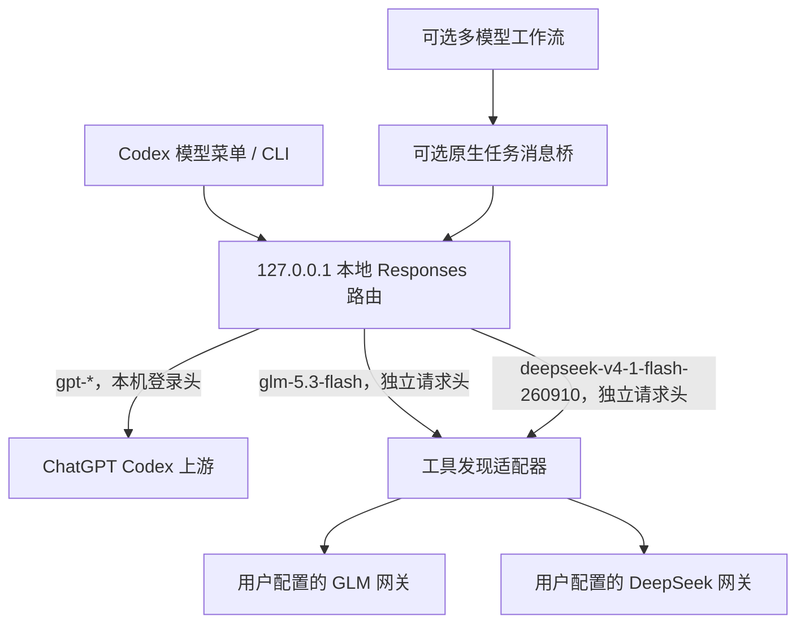

# 请求路径与协议边界

## 核心路由

路由只绑定 loopback，POST 必须携带本机随机生成的 `X-Codex-Router-Token`。仅允许 `/responses`、`/responses/compact`，同时支持 `/v1` 前缀。GPT 上游地址固定为源实现的 ChatGPT Codex 地址；外部模型精确匹配 ID，其他名称拒绝，不静默回退到 GPT。

GPT 沿用本机请求的账号认证头，移除 hop-by-hop 和本地路由密钥。GLM / DeepSeek 重新构造请求头白名单；如配置了网关密钥，只从该网关专属环境变量生成 Authorization。重定向被禁用。

跨提供方历史兼容移除不可移植的 reasoning 和 item ID，保留普通消息、工具输入输出与 `call_id`。OpenAI 带 encrypted content 的 reasoning 仅在 GPT 路由保留。该历史处理是源方案已有行为；“GPT 不受工具发现适配影响”指新增适配器分支不改 GPT 请求/流，不代表整个代理逐字节透传所有历史。

## 工具发现

`tool_search` 是发现当前未加载工具的 client 协议，不是 `web_search`。

1. 将 Codex 声明的 client `tool_search` 转成普通函数 `codex_local_tool_search`。
2. 外部模型调用该函数后，将 Responses 输出项转成 `tool_search_call`。
3. Codex 完成发现，并在后续历史中送来 `tool_search_output`。
4. 适配器保留工具调用关联，只合并 Codex 实际返回的工具定义，继续交给模型调用。

适配器不搜索、不执行工具、不持久保存聊天。它支持单个 client search 声明、命名空间合并、函数参数分片、JSON 与 SSE 响应。server tool search、名称冲突、无 call_id 的搜索历史会拒绝。单个 SSE frame 的内存上限为 16 MiB。代码执行环境、授权及工具执行仍由 Codex 负责。

## 上下文循环

旧部署曾把 DeepSeek 有效窗口设为 115,200 token，而压缩后的工具定义与历史仍超过该预算，导致立即再次压缩。调整模型目录预算并减少每轮工具声明解决了历史测试中的循环。压缩聊天不一定缩小每次重复附带的工具 schema；不能只看模型标称窗口。

## 可选原生任务桥

桥只替换工作流明确注册、模型/收件人/发件人匹配的 `agent_message`，使用主 Agent 自己登记的明文任务。它不解密消息，不改未注册任务。UUID 任务名、过期时间和单次任务约束避免误匹配；这不是对恶意本机进程的隔离边界。

工具发现适配器和任务桥相互独立：前者解决工具协议，后者解决已登记原生任务的消息传递。Skill 可以单独卸载，保留手动模型菜单路由。
